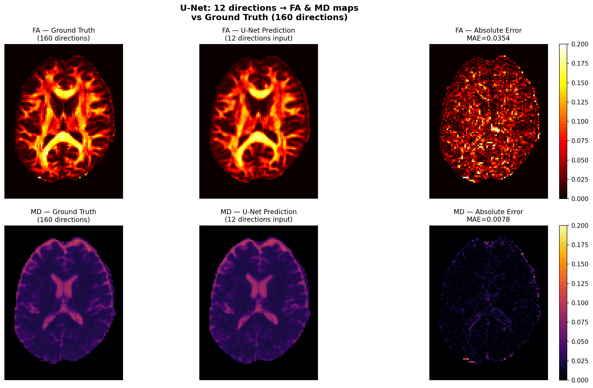
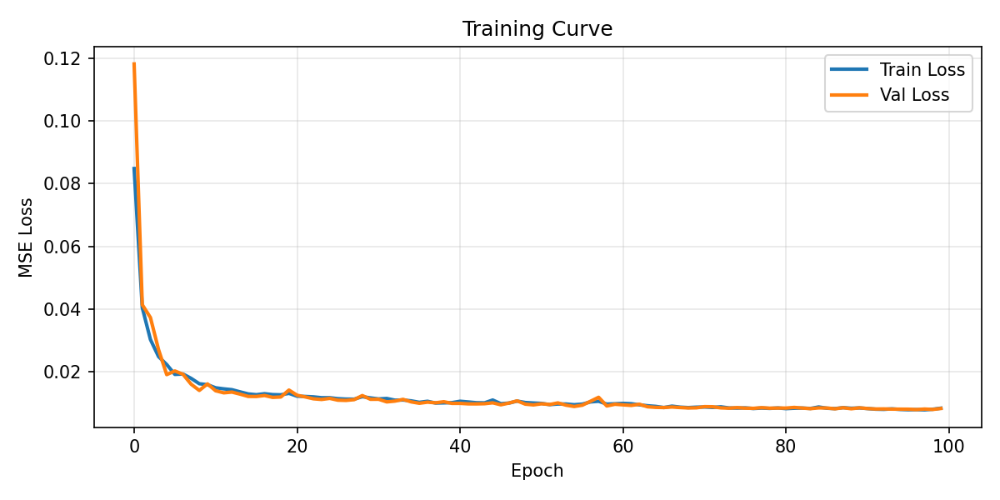

# Deep Learning for Accelerated Diffusion MRI Acquisition

A 2D U-Net that reconstructs FA and MD microstructure maps from 
undersampled diffusion MRI (12 directions) — achieving results 
comparable to a full 160-direction acquisition.

---

## Results

| Metric | Initial Version Value | Final Version Value | 
|--------|-----------------------|---------------------|
| FA MAE | 0.0534 |0.0354 |
| MD MAE | 0.0251 |0.0078 |
| Background | Yellow Noise | Clean Black |
| Loss Curve | Slightly Nosiy | Smooth and stable |
| Acquisition Speedup | ~13x (160 → 12 directions) |

- FA map is nearly indistinguishable from ground truth
- MD error map is almost entirely dark — near perfect reconstruction
- Clean loss curve showing smooth convergence with no overfitting

### FA & MD Map Comparison for updated version


### Training Curve for updated verison


---

## Motivation

Diffusion MRI protocols like WMTI and DKI require 60–160 gradient 
directions, leading to scan times of 30–60 minutes — too long for 
clinical use. This project trains a 2D U-Net to recover full 
microstructure maps from just 12 directions, enabling a potential 
13x reduction in acquisition time without sacrificing map quality.

---

## Method

### Pipeline
```
Input:  12 undersampled DWI directions  →  shape (22, 81, 106)
Model:  2D slice-wise U-Net
Output: FA + MD parameter maps          →  shape (2, 81, 106)
Target: DTI fit on full 160 directions  (ground truth)
```

### Model Architecture
- 2D U-Net with encoder-decoder structure
- Features: [32, 64, 128, 256]
- BatchNorm + ReLU activations
- Sigmoid output (maps normalized to [0, 1])

### Training Details
- Dataset: Stanford HARDI (81 × 106 × 76 volume, 160 directions)
- Undersampling: 12 randomly selected DWI directions + 10 b0 volumes
- Loss: Masked MSE + MAE (0.7 × MSE + 0.3 × MAE, brain voxels only)
- Optimizer: Adam (lr=1e-3), ReduceLROnPlateau scheduler
- Epochs: 100 | Batch size: 4
- Augmentation: Random horizontal + vertical flips
- Hardware: NVIDIA RTX 3070 Ti

---

## Project Structure
```
dMRI-accelerated/
├── data/
│   ├── raw/                   # downloaded data
│   └── processed/             # preprocessed .npy files
├── models/
│   ├── best_unet.pth          # saved model weights
│   └── history.npy            # training history
├── results/
│   ├── fa_md_comparison.png   # main results figure
│   └── loss_curve.png         # training curve
├── scripts/
│   ├── dataset.py             # PyTorch dataset class
│   ├── unet.py                # U-Net architecture
│   ├── preprocess.py          # data preprocessing
│   ├── train.py               # training loop
│   └── evaluate.py            # evaluation + figures
└── README.md
```

---

## Setup
```bash
# Clone the repo
https://github.com/chaudharivaibhav12/Microstructure-Direct-Estimation-using-a-2D-U-Net.git
cd dMRI-accelerated

# Create virtual environment
python -m venv dmri_env
dmri_env\Scripts\activate        # Windows
# source dmri_env/bin/activate   # Mac/Linux

# Install dependencies
pip install torch torchvision torchaudio --index-url https://download.pytorch.org/whl/cu126 #For my nvidia-drivers, please check your driver versions using nvidia-smi on terminal.
pip install nibabel dipy numpy scipy matplotlib scikit-learn tqdm
```

---

## Reproduce Results
```bash
# Step 1 — Download data and preprocess
python scripts/preprocess.py

# Step 2 — Train the model
python scripts/train.py

# Step 3 — Evaluate and generate figures
python scripts/evaluate.py
```

---

## Dependencies

| Package | Version |
|---------|---------|
| Python | 3.10 |
| PyTorch | 2.x (cu126) |
| DIPY | latest |
| Nibabel | latest |
| NumPy | latest |
| Matplotlib | latest |

---

## Future Work

- [ ] Extend to HCP dataset (1113 subjects) for robust generalization
- [ ] Add DKI metrics (MK, RK, AK) as additional targets
- [ ] Evaluate on clinical scanner data (1.5T / 3T)
- [ ] Compare against WMTI-Watson model parameter estimation
- [ ] Experiment with transformer-based architectures (SwinUNETR)

---

## Acknowledgements

Data: Stanford HARDI dataset via DIPY  
Inspired by: Golkov et al. (2016) q-space deep learning  
Built as a demo project for research in diffusion MRI acceleration

---

## Author

**Vaibhav Chaudhari**  
New York University — Courant Institute School of Mathematics, Computing, and Data Science

chaudharivaibhav12@gmail.com | vc2836@nyu.edu

[LinkedIn](https://www.linkedin.com/in/chaudharivaibhav)
[GitHub](https://github.com/chaudharivaibhav12)

```

---

## Two Things to Do Before Pushing

1. **Add your result images** — make sure `results/fa_md_comparison.png` and `results/loss_curve.png` are committed so they render in the README
2. **Add a `.gitignore`** to avoid pushing large data files:
```
# .gitignore
dmri_env/
data/raw/
data/processed/
*.nii.gz
__pycache__/
*.pyc
